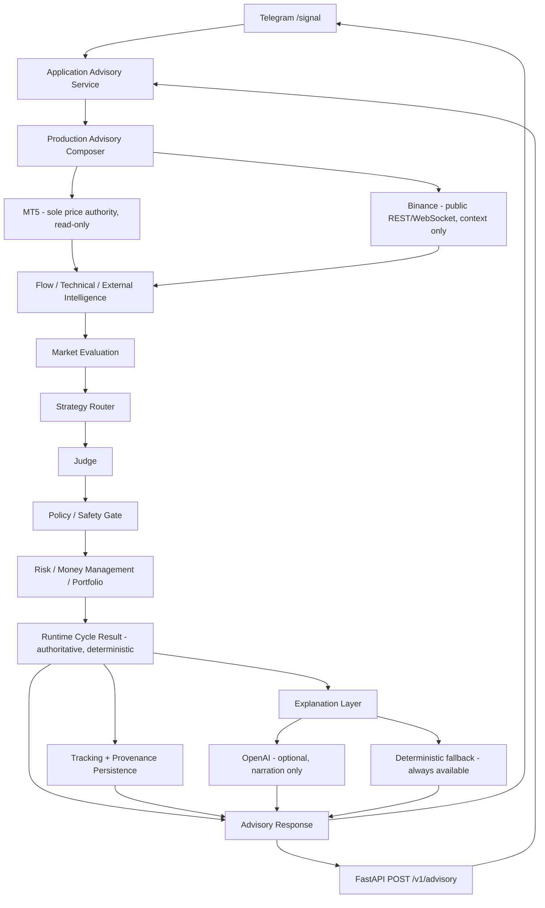

# AI Trading Advisor

A hierarchical advisory system for crypto trading: deterministic market
analysis, decision, and risk/portfolio management produce a trading
recommendation with an authoritative, typed trade fact set; an optional
LLM layer only narrates those already-decided facts in plain language. MT5
supplies executable price/account/broker facts (read-only) and Binance
supplies public flow/derivatives context. Results are delivered over
Telegram and a FastAPI HTTP API. The system is advisory-only end to end -
it never places, modifies, or closes an order.

## Key capabilities

- **MT5 is the sole price/account authority** - read-only integration
  (account state, instrument specs, OHLCV, position tracking); never an
  order-execution client
- **Binance public market data** - REST + WebSocket, spot and futures, feeds
  flow/derivatives context only, never price authority
- **Flow / Technical / External Intelligence analysis** - deterministic
  feature engines, specialized analysts, and contour supervisors
- **Market Evaluation** - structural cross-contour aggregation (participation,
  quality, scope alignment) with zero semantic interpretation
- **Strategy Router -> Judge -> Policy/Safety Gate** - structural eligibility,
  then semantic interpretation, then deterministic system-policy constraints
- **Broker-aware Risk / Money Management / Portfolio** - sizing, daily risk
  budget, diversification, all computed in `Decimal`, never by an LLM
- **Tracking + provenance persistence** - local, atomic JSON writes per trade
- **Idempotent logical cycles** - exactly-once cycle claiming, safe under
  duplicate/redelivered requests
- **Telegram bot and FastAPI HTTP API** - two independent delivery surfaces
  sharing one application service
- **Optional OpenAI explanation layer** - strict structured output, validated
  against a closed schema, narration only
- **Deterministic fallback** - always available; an LLM provider failure
  degrades explanation quality only, never the advisory cycle itself
- **5096 passing tests, 1 skipped** (pytest, fully offline/mocked - see
  [Testing](#testing))

## Architecture

Every cycle flows through one deterministic pipeline. MT5 and Binance are
deliberately asymmetric: MT5 is the sole source of executable price/account
facts, Binance is context-only. The Explanation Layer branches off *after*
the runtime result is already final - the LLM (when enabled) narrates that
result; it has no path back into it, and there is no order-placement
capability anywhere in the system.



## How one advisory cycle works

1. Telegram or the FastAPI API requests a fresh cycle for a logical cycle id.
2. MT5 supplies executable price/broker/account facts and OHLCV.
3. Binance supplies flow/derivatives context.
4. Deterministic analytical contours (Flow, Technical, External Intelligence)
   run and are aggregated by Market Evaluation.
5. The Decision layer (Strategy Router -> Judge -> Policy/Safety Gate)
   determines per-strategy-family outcomes.
6. Risk / Money Management / Portfolio validates and sizes any actionable
   recommendation.
7. The runtime cycle result becomes authoritative - direction, symbol, entry,
   stop, take-profit, volume, risk, or `NO_TRADE`, all already decided.
8. Tracking and provenance persistence record the result locally.
9. An optional LLM call (or the deterministic fallback) explains the
   already-decided facts - it runs only at this final step and cannot alter
   anything produced in steps 1-7.
10. The response is returned to Telegram or the API caller.

## Deterministic authority vs. LLM explanation

This is the core safety property of the system.

**The deterministic system exclusively owns:**
- direction, symbol, entry, stop-loss, take-profit
- approved volume, approved risk
- `NO_TRADE` outcome and reason
- runtime/cycle status

**The LLM may only:**
- explain and summarize already-decided facts
- produce a structured narrative grounded in the exact facts it was given

The LLM's own output schema has no field capable of representing a trading
fact - it is structurally incapable of asserting a direction, price, or size,
not merely instructed not to. Every LLM response is validated with strict
OpenAI structured output and re-checked against Pydantic models before use;
a response that fails validation is retried once, then the system falls back
to a deterministic, template-based explanation. A provider failure (timeout,
auth error, rate limit, malformed output) degrades explanation quality only
- it never invalidates an otherwise-completed advisory cycle.

## Safety boundary

- **V1 is advisory-only.** The system produces a recommendation; it never
  acts on it.
- **MT5 integration is read/tracking only** - account state, instrument
  specs, OHLCV, and position tracking.
- **No order placement, modification, or closing of any kind** exists
  anywhere in the codebase.
- **Manual execution remains the user's responsibility**, entirely outside
  this system.
- **The LLM has no execution access** - it never touches MT5, Binance, or
  any order-placement path, directly or indirectly.

## Tech stack

- Python
- Pydantic v2
- pytest / pytest-asyncio
- MetaTrader 5 Python integration
- Binance public REST/WebSocket
- OpenAI Responses API
- python-telegram-bot
- FastAPI / uvicorn
- Local JSON persistence (atomic writes, no database)

## Project structure

```
app/
  core/                  enums, domain models, configuration contracts
  market_data/           Binance provider, realtime streaming, data quality
  flow/ flow_analysts/ flow_supervisor/
                          Flow contour: features -> analysts -> supervisor
  technical/ technical_analysts/ technical_supervisor/
                          Technical contour: features -> analysts -> supervisor
  macro/ rates/ news/ news_intel/ onchain/
  external_intelligence_analysts/ external_intelligence_supervisor/
                          External Intelligence contour
  market_evaluation/      cross-contour structural aggregation
  strategies/             Strategy Router
  judge/                  semantic interpretation
  decision/               Policy / Safety Gate, high-impact-event gate
  risk/ money_management/ diversification/
                          risk engine, position sizing, portfolio
  statistics/             session/statistics aggregation
  mt5/                    MT5 client (read-only), tracking + provenance persistence
  orchestration/          runtime cycle, decision/risk pipeline, explanation
  production_advisory/    production composition/wiring
  llm/                    OpenAI adapter + provider protocol
  application/            application service, DTOs, cycle idempotency
  telegram/               Telegram bot, handlers, rendering
  api/                    FastAPI app, routes, models
  bootstrap/              environment/config loading for production
scripts/                  manual live checks (not part of the test suite)
tests/
```

## Setup

```bash
git clone https://github.com/boyarkavolzhentsev/ai-trading-advisor.git
cd ai-trading-advisor
python -m venv .venv
.venv\Scripts\activate          # Windows
pip install -r requirements.txt
copy .env.example .env
```

Then edit `.env`: configure the required advisory variables and your local
MT5 setup, and optionally Telegram/OpenAI (see below).

Requires Python 3.11+ (`StrEnum`, `Self`) and, for MT5 integration, Windows
with the MetaTrader 5 terminal installed.

## Environment variables

See [`.env.example`](.env.example) for the full list with inline comments.
Summary:

- Required advisory/instrument configuration (symbol mapping, timezone,
  calendar bridge path)
- Telegram bot token and authorized user id(s)
- Optional MT5 credentials (all-or-nothing; omit to use an already
  authenticated local terminal)
- Optional OpenAI configuration - `LLM_ENABLED=false` by default, so no
  OpenAI key is required to run the system
- Optional local persistence path overrides (sane defaults under `./data`)

## Running locally

Telegram bot:

```bash
.venv\Scripts\python.exe -m app.telegram.bot
```

FastAPI:

```bash
.venv\Scripts\python.exe -m uvicorn app.api.main:app --reload
```

## Testing

```bash
.venv\Scripts\python.exe -m pytest -q
```

```
5096 passed, 1 skipped
```

Coverage spans domain contracts, deterministic Flow/Technical/External
Intelligence analysis, Market Evaluation, Decision layer (Router/Judge/Policy
Gate), Risk/Money Management/Portfolio, MT5 adapters, tracking/provenance
persistence and cycle idempotency, the OpenAI adapter and deterministic
fallback, and Telegram/FastAPI wiring - all offline, against fakes/mocks.
No test in the suite calls a real external provider (MT5, Binance, OpenAI,
or Telegram); those are exercised only via separate, explicitly-run manual
scripts.

## V1 scope and limitations

- BTC-focused V1 (one logical symbol, mapped to one Binance and one MT5
  instrument)
- Local-first: local JSON persistence, no database, no required cloud
  deployment
- Advisory only - execution is manual, entirely the user's responsibility
- No guarantee of profitability or trading performance of any kind

## Roadmap

- Broader multi-asset/multi-symbol coverage
- Richer operational observability
- Tracking/provenance narrative enhancements in Telegram output
- Optional dashboard/frontend
- Optional deployment packaging
- Automated execution is not planned before extensive statistics and safety
  validation - it is not on the near-term roadmap

## Disclaimer

This software is educational/research software. It produces informational
analysis only. It is not financial advice, and it carries no guarantee of
profitability. Trading involves substantial risk of loss. The user remains
solely responsible for any trading decision made.
